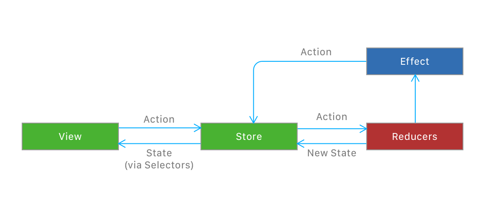
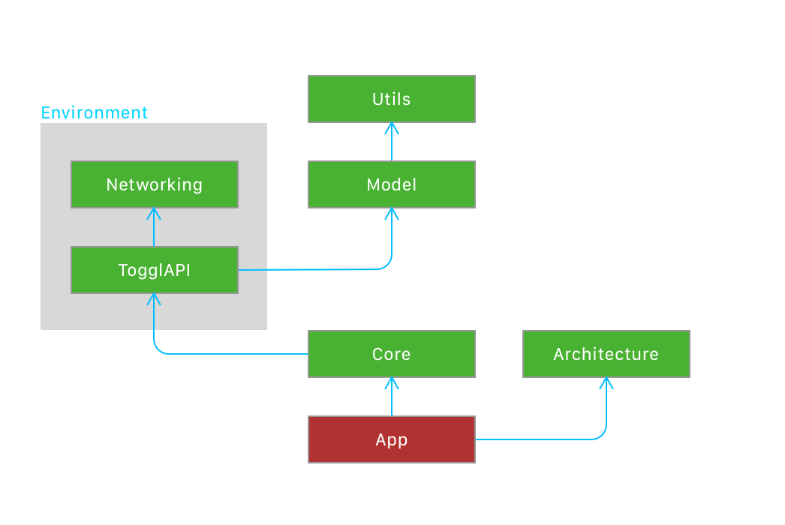

# Toggl WatchOS App

This is the repository for the official Toggl WatchOS App. It's built in SwiftUI for WatchOS 6 and up.

## Architecture

As the UI is going to be declarative thanks to SwiftUI, it makes sense to go the extra mile and use a unidirectional data flow style of architecture for the app.

This architecture is heavily based in Redux and takes some ideas from the composable architecture series at Point-free

*Store* It's the central part of the application. It contains the entire app state in the form of a single data structure. This state can only be modified by sending actions to the store, one at a time. The store is an `ObservableObject` and the state itself is `@Published`, so views can subscribe to changes on it.

*Actions* Are a declarative way of describing a state change, they contain no logic. They are passed through the store to the `Reducers` which will handle them.

*Reducers* These are pure functions and the only place where the state is mutated. A `Reducer` in its original form takes an `Action` and a `State` and return a new `State`. In this architecture they are a little more complicated as they modify the state via an inout parameter and return an `Effect`. They also take the `Environment` as a way to inject dependencies.

*Effects* After handling an action, reducers return an `Effect` which is a `Publisher` of `Actions` that will go back to the store as if they were sent from a view.

*Selectors* The entities in the state are normalized, meaning relationships are stored via ids. The selectors make the necessary transformations to turn the state into something the views can handle when a state change happens.




## Usage

The `Store` should be an `@ObservedObject` property in those views that want to get updates or send actions:

```swift
@ObservedObject var store: Store<AppState, AppAction, AppEnvironment>
```

Then to send an action you just do:

```swift
self.store.send(AppAction.loadAll)
```

And to access the observed state you just do it through the `value` property of the `Store`, most probably using a selector to aggregate and transform that data.

```swift
List {
  ForEach(sortedTimeEntriesSelector(store.state.timeline), id: \.id) { viewModel in
        TimeEntryCellView(viewModel: viewModel)
  }
}
```

**Note:** Right now selectors are not implemented and we are just using computed properties in the state. We have to change this.

## Environment

The `Environment` is a struct that contains all the app dependencies. It's sent into the `Store` as a constructor parameter, and it's injected into `Reducers` when they are run, this way every `Reducer` has access to an `Environment` and can use it as needed.

```swift
// Creating the store
Store(
  initialState: AppState(),
  reducer: logging(appReducer),
  environment: AppEnvironment()
)
```

```swift
// Dummy reducer. Imagine the AppEnvironment has a property that returns the current date
public var myReducer: Reducer<AppState, AppAction, AppEnvironment> = Reducer { state, action, environment in
    switch action {
        case .oneAction:
            state = doSomethingWithTheState(state)
            return .empty
        case .anotherAction:
            let currentDate = environment.currentDate
            state = doSomethingWithTheStateAndTheDate(state, date: currentDate)
            return .empty
    }
}
```

## Asynchronicity

To run asynchronous actions we use `Effects`. They return a `AnyPublisher<Action, Never>` when run. The store handles one action by passing it to the `Reducers`, these will return an `Effect`, if the `Effect` is not empty it'll be run by the store and that would result in the publisher returning one or more actions that will go back to being handled by the store.

```swift
public var projectReducer: Reducer<AppState, AppAction, Environment> = Reducer { state, action, Environment in
    switch action {
        case .loadProjects:
            state.loadingProjects = true
            return Effect {
              environment.api.loadProjects()
                .map { projects in .setProjects(projects) }
            }
        case let .setProjects(projects):
            state.loadingProjects = false
            state.projects = projects            
            return .empty
        default:
            return .empty
    }
}
```

As you can see in the example above, when handling the `.loadProject` action only one change is made to the state directly (setting the loading property to true), but the `Reducer` returns an `Effect` that will run the api request when executed. This `Effect` will map the results of the request and return a `.setProjects` action that will go back to the store and the reducer. When handling that `Action` the `Reducer` will make the appropriate changes to the store and return an empty `Effect` as no further actions are needed.

## Reducer Pullbacks

If we look carefully at the `projectReducer` in the previous point we'll soon see it knows too much stuff for what it needs to do. In the real app, this reducer should only handle actions related to projects, say `ProjectAction`, also it should only modify the part of the state that handles projects and finally it should only need a part of the `Environment`, in this case just the API.

Having the following:

```swift
public enum ProjectAction
{
    case setProjects([Project])
    case loadProjects
}

public enum AppAction
{
    case projects(ProjectAction)
    case loadAll
}

public struct AppState
{
    public var projects: [Project] = []
    public var whatever: Int = 0
}

```

This is how the reducer should look like:

```swift
public var projectReducer: Reducer<[Project], ProjectAction, API> = Reducer { state, action, api in
    switch action {
        case .loadProjects:
            return Effect {
              api.loadProjects()
                .map { projects in .setProjects(projects) }
            }
        case let .setProjects(projects):
            state = projects            
            return .empty
    }
}
```

Notice how we don't need a default case anymore, because we are dealing with all possible actions.

But the problem now is that the app still needs a `Reducer<AppState, AppAction, Environment>`, to be able to use this reducer like that we use a `pullback` function:

```swift
pullback(
    projectReducer,
    state: \.projects,
    action: \.projects,
    environment: \.api
),
```

This function transforms the specific reducer, with only the things it cares for, to the global one that the store needs.

The only caveat is that for those `KeyPaths` to work for the actions we need to create some properties in the `AppAction` enum (this only happens with enums, so the state and environment are fine)

```swift
public extension AppAction
{    
    public var projects: ProjectAction? {
        get {
            guard case let .projects(value) = self else { return nil }
            return value
        }
        set {
            guard case .projects = self, let newValue = newValue else { return }
            self = .projects(newValue)
        }
    }
}
```

## Store views

We can do something similar to the above but for views. We might have a view that only cares for a certain part of the state and only wants to send certain actions. In that case, when we pass the state to that view we can transform it into a view to the store.

```swift
let projectsStore: Store<[Project], ProjectAction, Environment> = store.view(
  state: { $0.projects },
  action: { .projects($0)}
)
```

## Modularity

The app is divided into different frameworks, the following part shows the compile dependencies between them.



We could even go further and using pullbacks and store views divide the different app modules into different frameworks, but I haven't done this for now to keep things a bit simpler.
